# Build and Release flutter app

## Android (Unix-like environment Instruction) (NOT YET SIGNED THE APP TO UPLOAD TO PLAYSTORE)

## Install adb tool for gaining access root dir in android devices

- Windows [download lastest version](https://dl.google.com/android/repository/platform-tools-latest-windows.zip) then set `adb` to ENV_VAR in cmd or powershell

- MacOS (Using Homebrew)

  ` brew install android-platform-tools`

- Linux

  - Debian based (APT)

    `sudo apt install adb`

  - Arch based (Pacman)

    `sudo pacman -S android-tools`

  - Fedora based

    - DNF

      `sudo dnf install adb`

    - RPM_OSTREE

      `sudo rpm-ostree install adb`

  - Opensuse based (ZYPPER)

    `sudo zypper in android-tools`

  - RHEL based (YUM)

    `sudo yum install android-tools`

  - NixOS

    Add these lines to `configuration.nix` to enable adb in NixOS for unprivileged users.

    ```nix
    {
    programs.adb.enable = true;
    users.users.<your-user>.extraGroups = ["adbusers"];
    }
    ```

    Install globally

    `nix-env -i androidenv.androidPkgs_9_0.platform-tools`

    Or using `nix-shell`

    `nix-shell -p androidenv.androidPkgs_9_0.platform-tools`

Verify your installation by typing on the terminal

`adb --version`

#### If adb server version doesn't match this client (Except for NixOs, MacOs and Windows)

run

```bash
sudo rm /usr/bin/adb
sudo ln -s /home/$USER/Android/Sdk/platform-tools/adb  /usr/bin/adb
```

### Choose between device and emulator

```
adb -d shell (or adb -e shell)
```

    -d - Direct an adb command to the only attached USB device. Returns an error when more than one USB device is attached.

    -e - Direct an adb command to the only running emulator. Returns an error when more than one emulator is running.

### Enable Developer Mode & USB Debugging for android

1. Tap on the Settings (gear icon) icon to open the setting on your Android device.

2. Now on the Android Settings screen, tap on About phone option. If you are using a LG device then you have to dig even deeper. Open Settings and scroll down to the bottom and tap on System > Advanced > About Phone.

   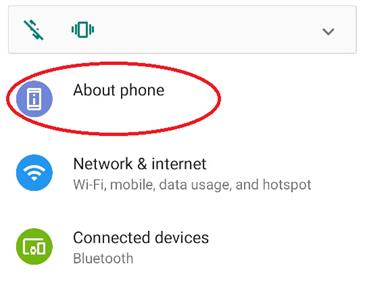

3. On the About phone screen scroll down to the bottom of the screen to Build number option.

   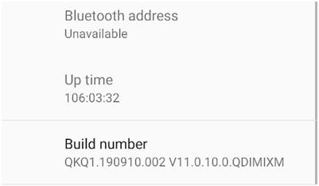

4. Now once you start tapping on the Build number option, you will see a pop-up message that you are now “X” steps away from being a developer.

   

5. Continue tapping on the Build number option until you see a screen to Re-enter your password.
   Since developer mode is one of the most powerful features in Android therefore to prevent any unauthorized access you have to enter the device password that you have set to continue further.

6. Now once you enter your device password, it will show a message at the bottom of the screen that is, You are now a developer.

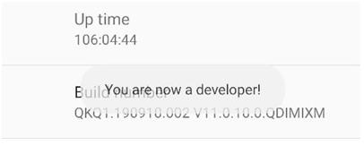

7. Now jump back to Settings and scroll back down to the bottom where you accessed About phone.

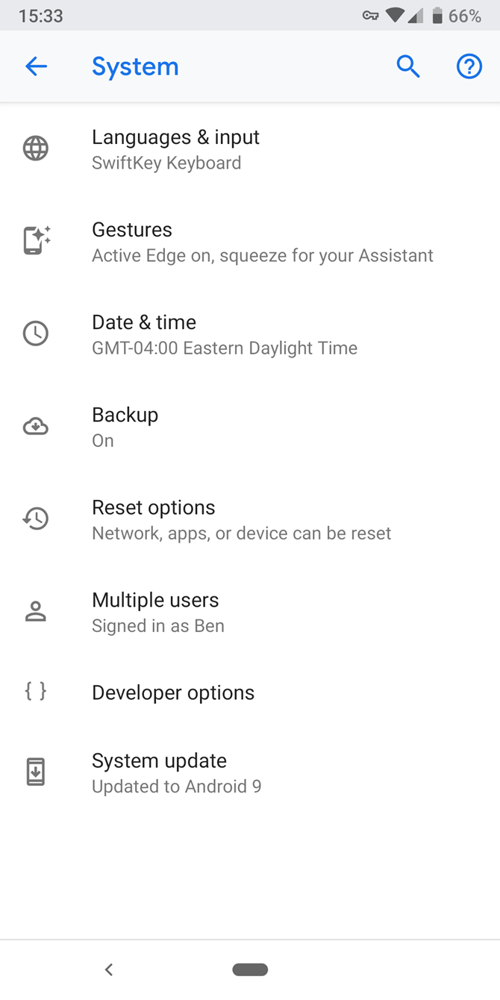

8. Look for USB debugging under the Debugging header. Hit the slider to enable it, and confirm Android's warning that you understand what this feature is for.

<div style='display: flex'>
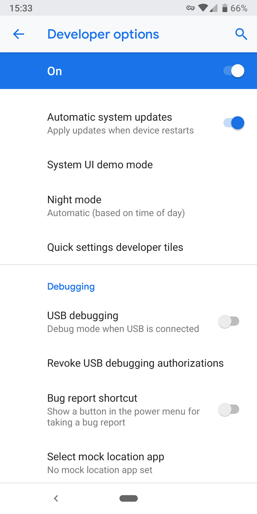  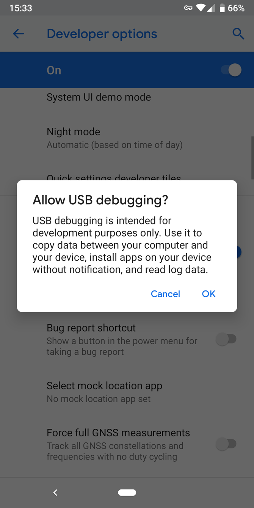
</div>

### Build an APK for each target ABI (Application Binary Interface)

From the command line:

1. Enter `cd [project]`

1. Run `flutter build apk --split-per-abi`

(The flutter build command defaults to --release.)

This command results in three APK files:

```
[project]/build/app/outputs/apk/release/app-armeabi-v7a-release.apk
[project]/build/app/outputs/apk/release/app-arm64-v8a-release.apk
[project]/build/app/outputs/apk/release/app-x86_64-release.apk
```

Removing the --split-per-abi flag results in a fat APK that contains your code compiled for all the target ABIs.

Such APKs are larger in size than their split counterparts, causing the user to download native binaries that are not applicable to their device’s architecture.

### Install an APK on a device

From the command line:

1. Connect your Android device to your computer with a USB cable.
1. Enter cd [project].
1. Run flutter install.

### Or build directly to your phone

From the command line:

1. Connect your Android device to your computer with a USB cable.
1. Enter cd [project].
1. Run `flutter run --release`.

   (The flutter run command defaults to --debug.)

1. After each run, your app will be saved in `/system/app` root directory on your phone. So you cannot entirely remove it from your device by simply clicking uninstalling button. To remove it run `adb uninstall <package_name>`.

## IOS (NOT YET SIGNED THE APP WITH Bundle ID TO UPLOAD TO APPSTORE)

### Enable development mode in IOS

1. Connect your iOS device to the macOS machine.
   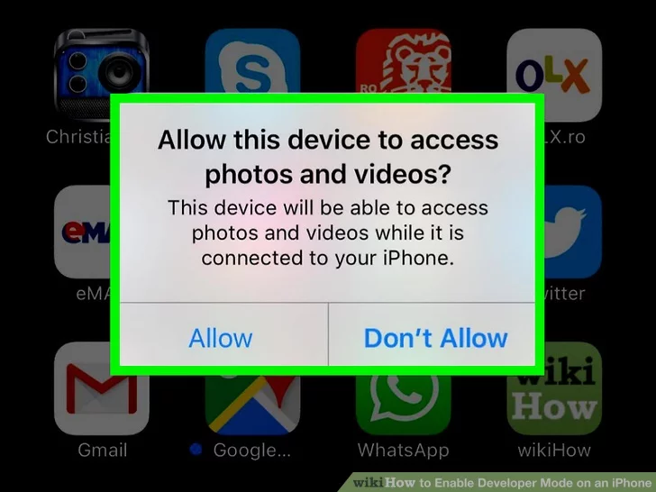
   Select Allow

1. On the macOS machine, select XCode > Window.

1. Click the Devices tab and select your device. (If your devices are labeled 'unsupported'. Consider upgrading your Xcode to latest version)

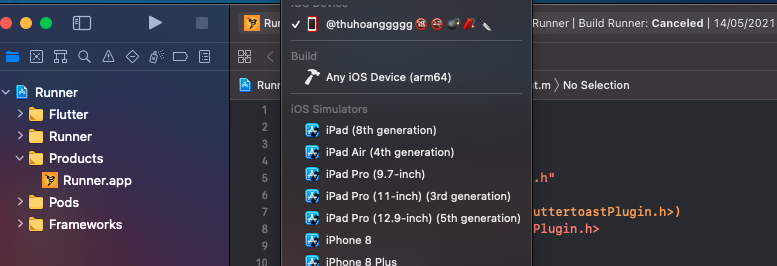

1. On your phone check if the development option is visible

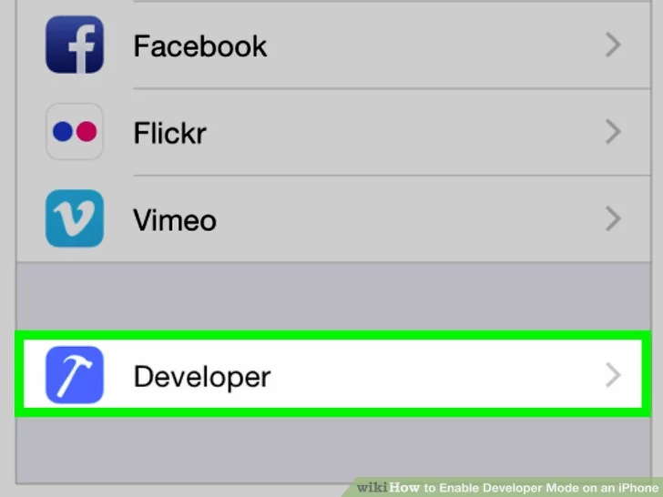

### Review Xcode project settings and change when needed

- Check your bundle identifier and change it if it conflicts with other packages

  

- Verify deployment info (IOS version and build target)

  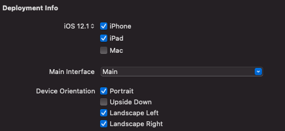

- Examine if you are sign-in to Xcode or not

  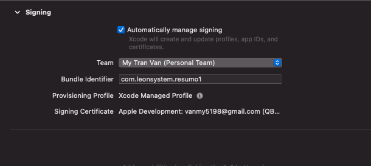

- Review your build profile

  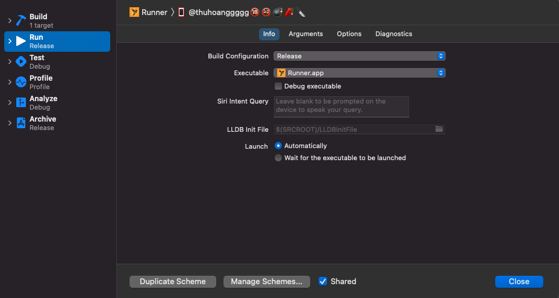

### Build an APP file

From the command line:

1. Run

```
flutter clean &&
rm ios/Podfile.lock pubspec.lock &&
rm -rf ios/Pods ios/Runner.xcworkspace
```

to clean up flutter caches

2. Run `flutter build ios`

(The flutter build command defaults to --release.)

This command results in one APP files:

```
[project]/build/app/outputs/release.app
```

### Or build directly to your phone

From the command line:

1. Connect your IOS device to your computer
1. Enter cd [project].
1. Run `flutter run --release`.

   (The flutter run command defaults to --debug.)
